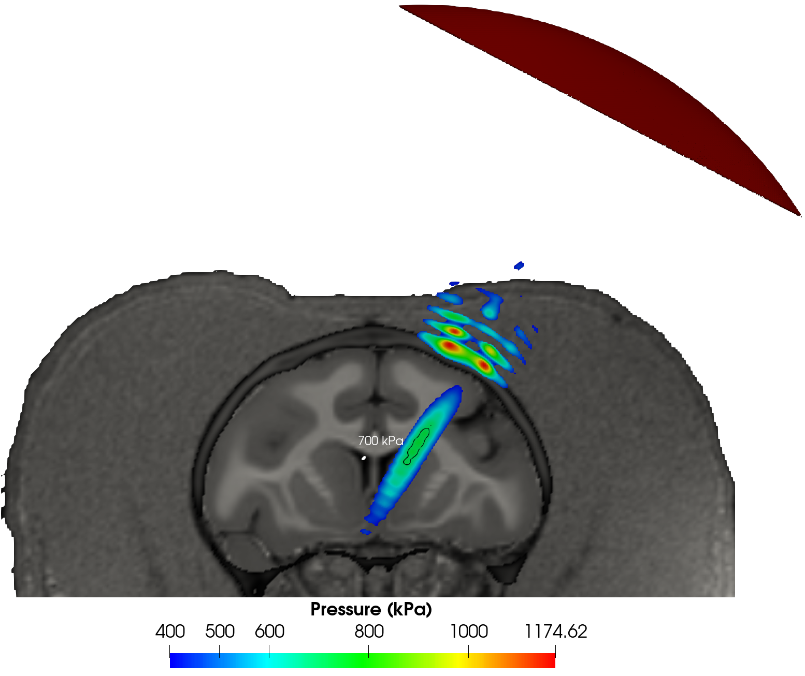
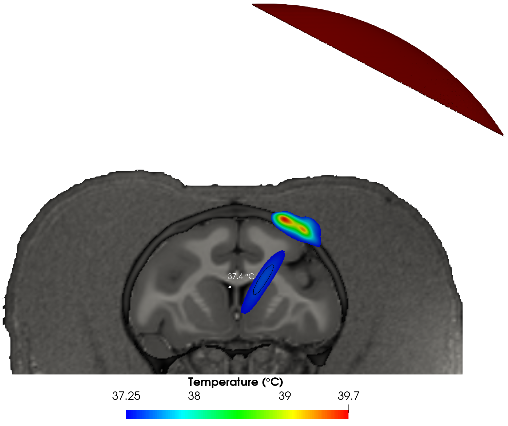

# FUS

Simulations done in the study "Effects of focused ultrasound Neuromodulation and BBB opening in dorsal striatum of non-human primates: alteration of functional connectivity in cortical regions and major brain networks"\

